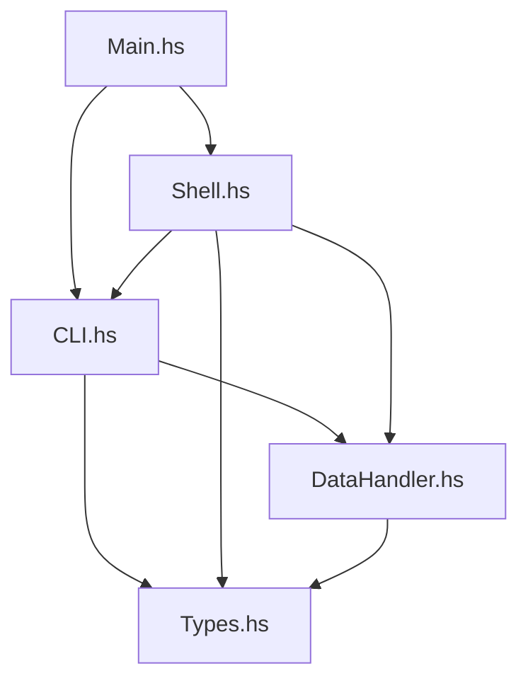

# 📘 Entwickler-Handbuch: Haskell JSON Manager

**Version:** 1.0.0

**Datum:** 03.12.2025

**Status:** Final Release

---

## Inhaltsverzeichnis

1. [Architektur & Design](#1-architektur--design)

2. [Refactoring-Historie & Maßnahmen](#2-refactoring-historie--maßnahmen)

3. [Code-Deep-Dive](#3-code-deep-dive)

4. [Features & User Guide](#4-features--user-guide)

5. [Build & Deployment](#5-build--deployment)

6. [Live Testing & Präsentations-Leitfaden](#6-live-testing--präsentations-leitfaden)

---

## 1. Architektur & Design 🏗️

### 1.1 Design-Philosophie

Das Projekt "Haskell JSON Manager" wurde unter strikter Einhaltung funktionaler Design-Prinzipien entwickelt. Das Hauptziel war die Schaffung einer robusten, wartbaren und typsicheren Anwendung zur Verwaltung von JSON-Datensätzen.

#### Single Source of Truth (SSOT)

Ein zentrales Architektur-Merkmal ist das **Single Source of Truth** Prinzip beim Parsing.

* **Problem**: In früheren Versionen existierten redundante Parsing-Logiken in der CLI (`CLI.hs`) und der interaktiven Shell (`Shell.hs`). Dies führte zu Inkonsistenzen und doppeltem Wartungsaufwand.

* **Lösung**: Die gesamte Parsing-Logik wurde in `CLI.parseCommand` zentralisiert. Sowohl die Kommandozeilen-Argumente als auch die Eingaben in der Shell durchlaufen exakt denselben Parser. Dies garantiert konsistentes Verhalten in beiden Modi.

### 1.2 Modul-Übersicht

Das System besteht aus fünf Kern-Modulen, die klar definierte Verantwortlichkeiten haben.



#### `Types.hs`: Das Herzstück (Datenmodell)

Dieses Modul definiert die Domänen-Typen.

* **Vorher**: Daten wurden teilweise als lose Tupel oder einfache Strings herumgereicht. Befehle wurden ad-hoc als Strings interpretiert.

* **Nachher**: Einführung von **Algebraischen Datentypen (ADTs)**.

* `data Record`: Repräsentiert einen Datensatz (`id`, `name`, `value`).

* `data Command`: Repräsentiert eine Aktion (`Insert`, `Update`, `Delete`, etc.).

* **Warum ADTs?**: Sie garantieren **Typsicherheit**. Der Compiler zwingt uns, jeden möglichen Befehl (`Command`) in den `case`-Ausdrücken zu behandeln (Exhaustiveness Check). Ein Tippfehler im Befehlsnamen führt zu einem Compile-Time-Error, nicht zu einem Runtime-Error.

#### `CLI.hs`: Parsing & Logik

Hier liegt die Geschäftslogik.

* **Vorher**: Vermischung von `IO` (Ausgabe auf Konsole) und Logik (Berechnung). Parsing war "inline" in den Handler-Funktionen.

* **Nachher**: Strikte Trennung.

* `parseCommand :: String -> [String] -> Either String Command`: Eine **pure Funktion**, die Text in Typen wandelt.

* `logic*` Funktionen (z.B. `logicInsert`): **Pure Funktionen**, die Listen transformieren. Sie wissen nichts von Dateien oder Konsolen.

* `executeCommand`: Die einzige Stelle, die `IO` macht (Brücke zwischen Logik und Welt).

#### `Shell.hs`: Interaktive REPL

Die Read-Eval-Print-Loop.

* **Vorher**: Eigene Parsing-Logik ("Spaghetti-Code" mit vielen `if/else`).

* **Nachher**: Nutzt `CLI.parseCommand`. Der State (die aktuelle Liste der Records) wird über **Rekursion** (siehe `runShell`) weitergereicht, da es in Haskell keine veränderlichen Variablen gibt.

#### `DataHandler.hs`: Persistenz

Kapselt den Zugriff auf das Dateisystem.

* **Vorher**: Unsicheres `readFile` / `writeFile`, das bei fehlenden Dateien abstürzte.

* **Nachher**: Nutzung von `Control.Exception.try`. Fehler (z.B. "Datei nicht gefunden", "Keine Rechte") werden abgefangen und sauber als Fehlermeldung ausgegeben (`exitFailure`), statt das Programm crashen zu lassen.

---

## 2. Refactoring-Historie & Maßnahmen 🛠️

Das Projekt hat eine signifikante Evolution durchlaufen. Hier sind die wichtigsten Meilensteine:

### Maßnahme 1: Zentralisierung des Parsings

* **Ausgangslage**: Die Shell parste Befehle wie `insert 1 Bob 10` manuell durch String-Splitting. Das CLI nutzte `getArgs`. Wenn sich die Syntax für `insert` änderte, musste man es an zwei Stellen anpassen.

* **Umsetzung**: `CLI.hs` exportiert nun `parseCommand`.

* **Effekt**: Die Shell ruft einfach `parseCommand inputStr args` auf. Code-Reduktion in `Shell.hs` um ca. 40%.

### Maßnahme 2: Trennung von Pure & Impure

* **Ausgangslage**: Funktionen wie `handleInsert` luden die Datei, prüften die ID, fügten hinzu und speicherten – alles in einem Block.

* **Umsetzung**: Extraktion der Logik in `logicInsert :: Int -> String -> Double -> [Record] -> Either String [Record]`.

* **Effekt**: Diese Logik ist nun **ohne Mocking** testbar. Wir können `logicInsert` einfach mit einer Liste `[]` aufrufen und prüfen, ob das Ergebnis stimmt.

### Maßnahme 3: Migration Stack -> Cabal

* **Ausgangslage**: Nutzung von `stack`.

* **Umsetzung**: Wechsel auf das native `cabal` Build-System. Erstellung einer sauberen `grp32.cabal` Datei, die Abhängigkeiten (`aeson`, `bytestring`) explizit listet.

* **Effekt**: Standardkonformität. Das Projekt lässt sich auf jedem System mit GHC/Cabal bauen, ohne Stack installieren zu müssen.

### Maßnahme 4: Einführung des `Update` Commands

* **Ausgangslage**: Datensätze konnten nur gelöscht und neu angelegt werden.

* **Umsetzung**:

1. Erweiterung `data Command = ... | Update ...` in `Types.hs`.

2. Implementierung `logicUpdate` in `CLI.hs` (Suchen & Ersetzen in der Liste).

3. Integration in `parseCommand` und `Shell.hs`.

* **Effekt**: Vollständige CRUD-Funktionalität.

---

## 3. Code-Deep-Dive 🧐

### 3.1 `parseCommand` (in `CLI.hs`)

Diese Funktion ist das Tor zur Anwendung.

```haskell

parseCommand :: String -> [String] -> Either  String  Command

parseCommand "insert" (idStr:name:valStr:_) =

case (readMaybe idStr, readMaybe valStr) of

(Just i, Just v) -> Right (Insert i name v)

(Nothing, _) -> Left "Fehler: ID muss eine Ganzzahl sein."

(_, Nothing) -> Left "Fehler: Wert muss eine Zahl sein."

```

* **Pattern Matching**: Wir matchen auf den Befehlsnamen (`"insert"`) und die Argumentliste.

* **`readMaybe`**: Statt `read` (was crashen kann), nutzen wir `readMaybe`. Es liefert `Nothing`, wenn der String keine Zahl ist. Das macht das Parsing extrem robust.

### 3.2 `logicInsert` (in `CLI.hs`)

Die reine Geschäftslogik für das Einfügen.

```haskell

logicInsert :: Int -> String -> Double -> [Record] -> Either  String [Record]

logicInsert newId name val records =

if any (\r -> Types.id r == newId) records

then Left "Fehler: Diese ID ist schon vorhanden."

else Right (records ++ [Record newId name val])

```

* **Duplikat-Check**: `any` prüft effizient, ob die ID schon existiert.

* **Immutability**: Wir verändern die Liste nicht (geht in Haskell nicht), sondern geben eine *neue* Liste zurück (`records ++ [...]`).

### 3.3 `runShell` (in `Shell.hs`)

Die Hauptschleife der Shell.

```haskell

runShell :: FilePath -> [Record] -> IO ()

runShell filename records = do

input <- getLine

-- ... parsing ...

case result of

Right newRecords -> runShell filename newRecords -- Rekursion mit NEUEM Zustand

Left err -> runShell filename records -- Rekursion mit ALTEM Zustand

```

* **State-Passing**: Der "Zustand" der Anwendung ist einfach das Argument `records`. Wenn wir Daten ändern, rufen wir `runShell` mit den neuen Daten auf. Das ist das funktionale Äquivalent zu einer `while(true)` Schleife mit veränderlichen Variablen.

### 3.4 `makeBackup` (in `DataHandler.hs`)

Sicherheit geht vor.

```haskell

makeBackup :: FilePath -> [Record] -> IO ()

makeBackup path records = do

timestamp <- formatTime defaultTimeLocale "%Y-%m-%d_%H-%M-%S" <$> getCurrentTime

let backupFile = base ++ "_" ++ timestamp ++ ".bak" ++ ext

B.writeFile backupFile (encodePretty records)

```

* **Timestamp**: Wir generieren einen sekundengenauen Zeitstempel.

* **Automatik**: Diese Funktion wird *automatisch* von `saveRecords` aufgerufen. Der Entwickler kann es nicht vergessen.

---

## 4. Features & User Guide 📖

### CRUD-Operationen

Die Kernfunktionalität zur Datenverwaltung.

1. **Create (Insert)**

* `insert <ID> <Name> <Wert>`

* Beispiel: `insert 1 "Laptop" 999.99`

* *Schutz*: Verhindert doppelte IDs.

2. **Read (Query & Filter)**

* `list` / `print`: Zeigt alle Daten formatiert an.

* `query <Name>`: Sucht Teilstrings (Case-Insensitive). Bsp: `query lap` findet "Laptop".

* `filter <Wert>`: Zeigt alle Einträge mit `value > Wert`. Bsp: `filter 500`.

3. **Update (Neu!)**

* `update <ID> <NeuerName> <NeuerWert>`

* Beispiel: `update 1 "Gaming Laptop" 1200.00`

* *Logik*: Sucht ID 1 und überschreibt Name/Wert. Fehler, wenn ID nicht existiert.

4. **Delete**

* `delete <ID>`

* Beispiel: `delete 1`

### Statistik (`stats`)

Ein Analyse-Tool für die numerischen Werte (`value`).

* Berechnet: Anzahl, Summe, Durchschnitt (Arithmetisches Mittel), Minimum, Maximum.

* Beispiel Output:

```text

Statistik:

Anzahl: 3

Summe: 150.0

Durchschnitt: 50.0

Min: 10.0

Max: 100.0

```

### Persistenz & Sicherheit

* **Format**: Standard JSON (`.json`).

* **Pretty Printing**: Die Dateien sind menschenlesbar formatiert (eingerückt).

* **Backup**: Jedes `save` erstellt eine `.bak.json` Datei.

---

## 5. Build & Deployment 📦

### Voraussetzungen

* GHC (Glasgow Haskell Compiler)

* Cabal (Build Tool)

### Ordnerstruktur der Abgabe

* `src/`: Enthält den gesamten Source Code (`Main.hs`, `CLI.hs`, etc.).

* `docs/`: Enthält diese Dokumentation und weitere Anleitungen.

* `tests/`: Enthält die Python Test-Suite.

* `grp32.cabal`: Die Projektkonfiguration.

### Befehle

1. **Bauen**:

```powershell

cabal build

```

Lädt Abhängigkeiten (aeson, etc.) und kompiliert das Projekt.

2. **Starten (CLI)**:

```powershell

cabal run grp32-exe -- --help

```

3. **Starten (Shell)**:

```powershell

cabal run grp32-exe

```

4. **Aufräumen**:

```powershell

cabal clean

```
